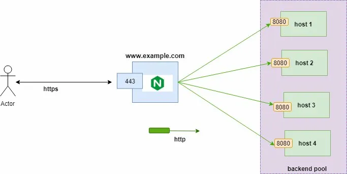

# Nginx Load Balancer - Teaching Lab

This repo is a *teaching lab* that demonstrates how a simple nginx reverse proxy (round-robin) evolves into a production-quality load balancer with health checks, retries, connection management, and failover capabilities.

## Architecture Overview

### Basic Load Balancing Flow



The diagram above shows the fundamental load balancing flow:
- **Actor** (user/client) sends HTTPS requests to `www.example.com`
- **Nginx** (port 443) receives the request and distributes it
- **Backend Pool** contains multiple hosts (host 1-4) running on port 8080
- Requests are distributed via HTTP to the backend servers

### VPC-Based Architecture (Cloud Deployment)

.webp)

This diagram illustrates a production cloud deployment:
- **User** accesses the system through a public IP
- **Reverse Proxy / Load Balancer** sits in a VPC with both public and private IPs
- Traffic is routed to multiple backend instances (Frontend, Backend1, Backend2)
- **GCP Cloud NAT** handles egress traffic for private instances
- All components operate within isolated network segments

## What This Load Balancer Does

* ✅ Detects and isolates failing backends (passive health checks)
* ✅ Retries transient failures to protect users
* ✅ Avoids slow-server poisoning with `least_conn` algorithm
* ✅ Protects backends from connection storms via connection limiting
* ✅ Uses keepalive to reuse backend connections (reduces latency)
* ✅ Provides weighted routing for canary deployments
* ✅ Comprehensive logging with upstream timing metrics

## Prerequisites

* Docker & Docker Compose (Docker Desktop on Windows works)
* bash (Git Bash or WSL on Windows)
* curl
* (optional) `ab` (ApacheBench) for load testing

## Current Production Configuration

The project includes a production-ready nginx configuration with the following features:

**Key Features:**
- `least_conn` load balancing (sends requests to server with fewest connections)
- Weighted routing (server1 gets 95% of traffic by default)
- Keepalive connection pooling (64 connections)
- Passive health checks (max_fails=2, fail_timeout=10s)
- Automatic retry on failures (up to 3 attempts)
- Connection limiting (20 concurrent connections per IP)
- DNS resolution with Docker's internal resolver

## File Structure

```
.
├── README.md                  # This file
├── nginx.conf                 # Main nginx configuration
├── docker-compose.yml         # Docker setup
├── docs/
│   ├── basic-architecture.png # Basic LB diagram
│   └── vpc-architecture.png   # Cloud deployment diagram
└── tests/
    ├── run_tests.sh          # Automated test scenarios
    └── README.md             # Test documentation
```

## Quick Start

### 1. Start the Environment

```bash
# From project root
docker compose down -v
docker compose up --build
```

### 2. Verify Containers

```bash
docker ps
# Expected: nginx-load-balancer, server1, server2, server3
```

### 3. Test Basic Functionality

```bash
# Single request
curl http://localhost

# Continuous monitoring
while true; do curl -s -o /dev/null -w "%{http_code}\n" http://localhost; sleep 0.3; done
```

## Testing Scenarios

### Test 1: Health Check

```bash
curl http://localhost/health
# Expected: "Load balancer is healthy"
```

### Test 2: Load Distribution

```bash
# Make 20 requests and observe distribution
for i in {1..20}; do curl -s http://localhost; done
```

With `weight=95` on server1, you should see most traffic going to server1.

### Test 3: Failover (Backend Failure)

```bash
# Stop a backend server
docker stop server2

# Continue making requests - they should still succeed
for i in {1..10}; do curl -s http://localhost; sleep 0.5; done

# Restart the server
docker start server2
```

**Expected behavior:** Nginx automatically routes around the failed server.

### Test 4: Connection Limiting

```bash
# Attempt to exceed connection limit (20 concurrent per IP)
ab -n 1000 -c 25 http://localhost/
```

Some requests will receive 503 errors when the limit is exceeded.

### Test 5: View Upstream Metrics

```bash
# Check detailed logs with timing information
docker exec -it nginx-load-balancer cat /var/log/nginx/access.log
```

Log format includes:
- `upstream`: which backend server handled the request
- `rt`: total request time
- `urt`: upstream response time

## Configuration Deep Dive

### Load Balancing Algorithm

```nginx
upstream backend {
    least_conn;  # Send to server with fewest active connections
    keepalive 64; # Maintain 64 persistent connections
    
    server server1:80 weight=95 max_fails=2 fail_timeout=10s;
    server server2:80 max_fails=2 fail_timeout=10s;
    server server3:80 max_fails=2 fail_timeout=10s;
}
```

- **least_conn**: Prevents slow-server poisoning by distributing based on active connections
- **weight=95**: server1 receives 95/(95+1+1) ≈ 98% of traffic (canary deployment style)
- **max_fails=2**: Mark backend as down after 2 consecutive failures
- **fail_timeout=10s**: Stay down for 10 seconds before retry

### Retry Logic

```nginx
proxy_next_upstream error timeout http_500 http_502 http_503 http_504;
proxy_next_upstream_tries 3;
proxy_next_upstream_timeout 6s;
```

- Automatically retries failed requests on different backends
- Maximum 3 attempts across different servers
- Gives up after 6 seconds total

### Connection Management

```nginx
limit_conn_zone $binary_remote_addr zone=connlimit:10m;
limit_conn connlimit 20;
```

- Limits each IP address to 20 concurrent connections
- Prevents connection storms and abuse

### Keepalive Benefits

```nginx
proxy_http_version 1.1;
proxy_set_header Connection "";
keepalive 64;
```

- Reuses TCP connections to backends
- Reduces latency (no TCP handshake overhead)
- Decreases backend load

## Advanced Configurations

### Option 1: Basic Round-Robin (Learning)

Create `nginx.basic.conf`:

```nginx
upstream backend {
    server server1:80;
    server server2:80;
    server server3:80;
}
```

- Simplest form: equal distribution
- No health checks or retries
- Good for understanding basics

### Option 2: Rate Limiting (Traffic Control)

Uncomment in your current config:

```nginx
limit_req_zone $binary_remote_addr zone=perip:10m rate=10r/s;
limit_req zone=perip burst=10 nodelay;
```

- Limits requests to 10 per second per IP
- Allows bursts of 10 additional requests
- Protects backends from traffic spikes

### Option 3: Buffering for Slow Clients

Add to your config:

```nginx
proxy_buffering on;
proxy_buffers 16 16k;
proxy_busy_buffers_size 64k;
```

- Nginx buffers responses from backends
- Backends can close connection immediately
- Protects backends from slow client connections

## Troubleshooting

### Issue: All requests go to one server despite least_conn

**Cause:** Keepalive connections are reused, so the same connection handles multiple requests.

**Solution:** This is expected behavior. Under load, distribution will balance out.

### Issue: 502 Bad Gateway errors

**Check:**
```bash
# Are all backends running?
docker ps

# Check nginx error logs
docker logs nginx-load-balancer
```

### Issue: Connection limiting not working

**Verify:**
```bash
# Check if zone is configured
docker exec nginx-load-balancer nginx -T | grep limit_conn_zone
```

## Performance Tuning

### For High Traffic (1000+ req/s)

```nginx
events {
    worker_connections 65535;
    multi_accept on;
    use epoll;
}

http {
    keepalive_timeout 30;
    keepalive_requests 10000;
}
```

### For Low Latency

```nginx
tcp_nodelay on;
tcp_nopush on;
sendfile on;
```

## Use Cases

1. **Developer Learning**: Understand load balancing locally before deploying to cloud
2. **Interview Prep**: Demonstrate knowledge of HA architectures
3. **Testing Failures**: Safely test how your application handles backend outages
4. **Canary Deployments**: Use weighted routing to gradually roll out changes
5. **Connection Management**: Learn how to protect backends from connection storms

## Why This Matters

**Without a load balancer:**
- Single point of failure
- No automatic failover
- Slow clients block backend threads
- Manual intervention required for failures

**With this load balancer:**
- Automatic failover (max_fails + fail_timeout)
- User-transparent retries (proxy_next_upstream)
- Backend protection (connection limits, keepalive)
- Gradual rollouts (weighted routing)

## Next Steps

1. ✅ Run the basic setup and observe round-robin behavior
2. ✅ Test failover by stopping backends
3. ✅ Adjust weights to test canary deployments
4. ✅ Enable rate limiting and test with `ab`
5. ✅ Add monitoring with Prometheus/Grafana (future enhancement)

## Architecture Diagrams

The diagrams at the top of this README illustrate:

1. **Basic Architecture**: Shows the fundamental request flow from client through nginx to backend pool
2. **VPC Architecture**: Demonstrates a production cloud deployment with proper network isolation, public/private IPs, and NAT configuration

Both diagrams help visualize how the load balancer sits between clients and backends, managing traffic distribution and failover.

## Contributing

This is a teaching project. Feel free to:
- Add more test scenarios
- Improve configurations
- Add monitoring solutions
- Document additional failure modes

---

**License:** MIT  
**Author:** Learning Project  
**Last Updated:** 2025